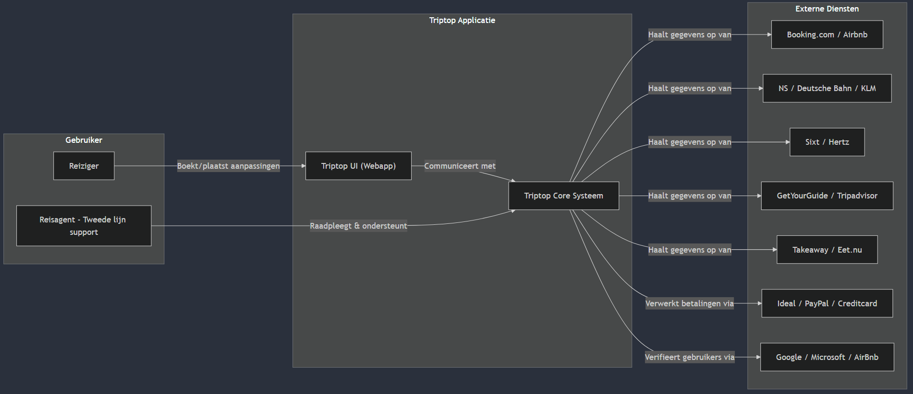

Tijdens deze les ging het over mijn hoofd heen met wat een C4 en een contextdiagram was en waar dat gemaakt kon worden. Dus heb ik een mermaid diagram gemaakt, wat niet echt op een C4-diagram lijkt. Naar mijn mermaid diagram werd er wel naar gekeken, dus het werd in ieder geval niet genegeerd door mijn groepsgenoten.

Als ik zo nu hier naar kijk is het ook wel een beetje vergelijkbaar met een container diagram 😅. Tijdens deze les was ik nog een beetje confused, maar later heb ik ook een manier gevonden hoe ik een context/container diagram naar mijn gevoel het makkelijkst kan maken.